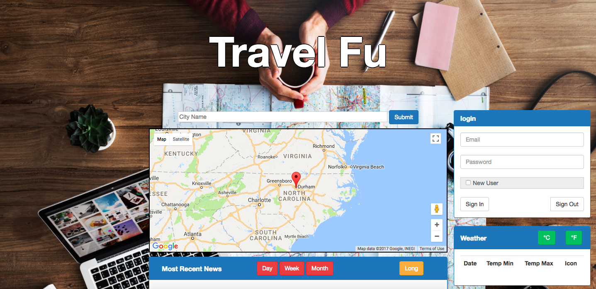
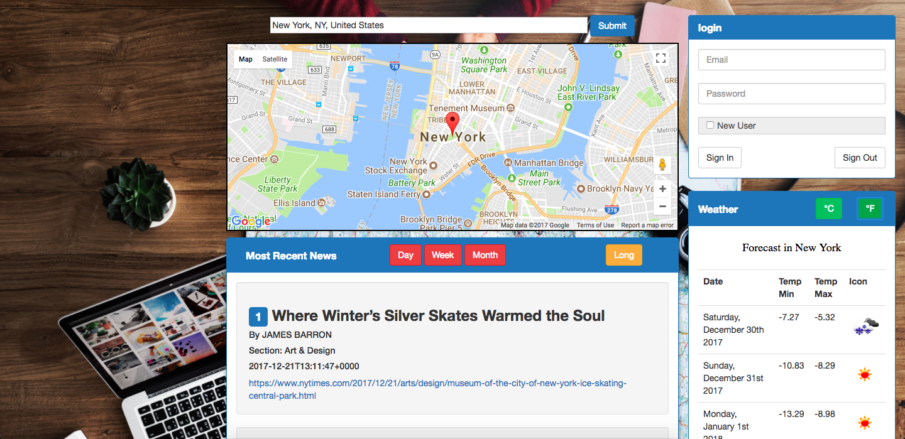
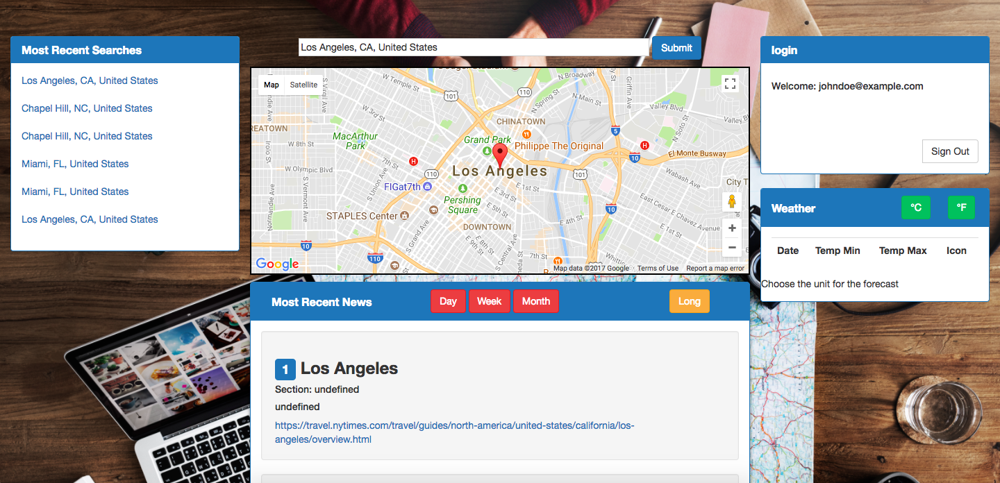

# Travel Fu

Travel Fu is your one-stop-shop for important travel information! Just input where you're heading, and you'll see it on a map, see local news articles, and a 7 day weather forcast. And as an added bonus for frequent travelers, you can log in and see your most recent searches for quicker viewing.

## Technologies Used:
- Weather API
- News API
- Google Maps API
- Bootstrap
- Google Firebase

## How it works:

1. The Home Page

2. Search Results

3. Sign In

_This app was developed by Max Wang, Ted Yang, Abhiijit Ghosh, and Manasi Sukthankar_